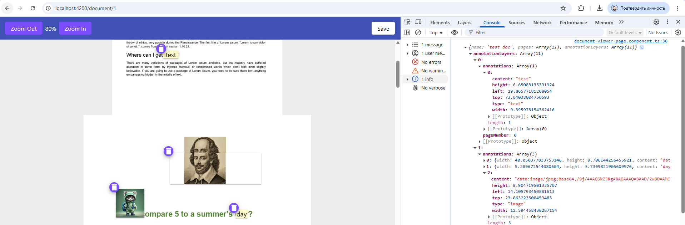
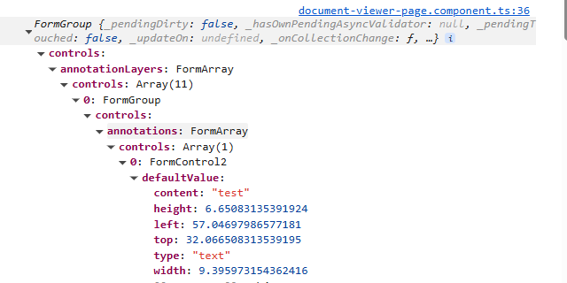

# Documents Viewer

## Скриншоты реализации

## Ссылка на приложение

[Ссылка на github-pages](https://daniilmaslof.github.io/document-viewer)

### Описание решения

- Используется виртуальный скролл (**CDK Virtual Scroll**). Без него, возможно, проще использовать стандартный document viewer.
- Используется **custom virtual scroll strategy** для поддержки страниц любого размера.  
    Сейчас размеры получаются из первых 32 байт (`Range: 'bytes=0-32'`) PNG-формата.  
    Лучше, чтобы размеры страниц приходили сразу из API.
>  **Минусы**: Нужно рассчитывать размеры на бэкенде и загружать информацию о размерах всех страниц. Необходимо добавить отдельное апи для загрузки слоя аннотаций и текстового слоя для одной страницы. В PNG может не быть метаинформации.

- Для **zoom** увеличиваю размер страниц и масштабирую offset скроллбара, чтобы не было сдвига.
- Для каждой страницы создаю невидимый слой аннотаций. Размер и позицию аннотаций рассчитываю в процентах для масштабирования.

  >  **Минусы**: Проценты недостаточно точны — возможна погрешность из-за округлений.

- Для аннотаций создал **CVA** (ControlValueAccessor) для изменения значения контрола при изменении положения (`cdk-drag-drop`).

  >  **Минусы**: Нельзя разместить аннотацию между страницами.
- Для загрузки изображения использую диалог `input file` + drag and drop + [readDataUrlAsImage](https://github.com/daniilmaslof/document-viewer/blob/master/projects/common/src/lib/core/utils/rxjs/read-data-url-as-image.ts).
  >  **Минусы**: Пользователь не видит сразу результат. Можно добавить cropper и отображать одну страницу в диалоге.

- Для сохранения создал форму следующего формата.
  
  >  **Минусы**: Всё, кроме аннотаций, может не изменяться — можно было бы создать просто `FormArray` для аннотаций.

- Для масштабирования `font-size` и кнопки удаления использую переменную `--scale-factor`.
### Известные проблемы
- Решена проблема со сдвигом viewport направо, когда приходит широкая страница.  
  Рассчитывается максимальная ширина документа, и заранее добавляется горизонтальный скролл.

- **Квадрирование**: если в документе много страниц формата A0, логично сразу заскейлить все страницы под viewport.  
  Предложенное решение — вычислять `squareFactor`.  
  Пока фикс закомментирован.

- Проблема загрузки полноразмерных изображений в `page`, `annotations`.

  > 💡 **Решение**: Добавить placeholder в base64 или загружать изображение низкого качества, а затем подгружать более качественное — например, при `scale` или остановке прокрутки.
- Поддержка функций, таких как красный карандаш.
  > 💡 **Решение**: Рендерить картинки в canvas.

- Добавить поддержку мобильных устройств.

  > 💡 **Решение**: Включить кадрирование, чтобы страницы по умолчанию помещались в экран, Оптимизировать все компоненты (диалоги, кнопки, меню) для удобной работы на сенсорных экранах.`.
- Отсутвие тестов.

  > 💡 **Решение**: До дедлайн было еще два дня. Добавить тесты. Удалить Karma и попробовать как angular внедрил vitest [experimental-unit-test](https://github.com/angular/angular/blob/main/adev/src/content/guide/testing/experimental-unit-test.md)